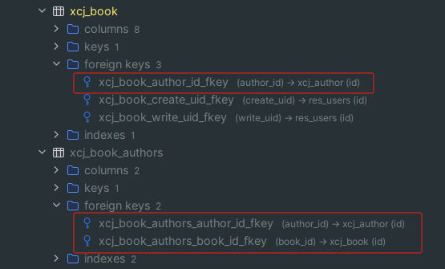
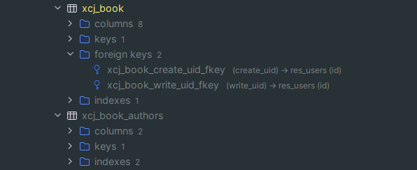

# Postgresql数据库端不建立外键关系，odoo ORM保留外键关系

组件使用方式，在外键字段上设置属性db_constraint=False，将会在数据库层将外键关系解除，保留orm层的外键关系

```python

class Author(models.Model):
    _name = 'xcj.author'
    name = fields.Char(string="姓名")
    book_ids = fields.One2many("xcj.book", "author_id", string="作品")


class Book(models.Model):
    _name = 'xcj.book'
    name = fields.Char(string="数目")
    code = fields.Char(string="编号")
    author_id = fields.Many2one("xcj.author", string="作者", db_constraint=False)
    author_ids = fields.Many2many("xcj.author", "xcj_book_authors", "book_id", "author_id", string="作者", db_constraint=False)

```


### 设置为True或者不配置db_constraint
```python

    author_id = fields.Many2one("xcj.author", string="作者")
    author_ids = fields.Many2many("xcj.author", "xcj_book_authors", "book_id", "author_id", string="作者")
# 或
    author_id = fields.Many2one("xcj.author", string="作者", db_constraint=True)
    author_ids = fields.Many2many("xcj.author", "xcj_book_authors", "book_id", "author_id", string="作者", db_constraint=True)

```



### 设置为False（将不会建立数据库层面的外键关系）
```python

    author_id = fields.Many2one("xcj.author", string="作者", db_constraint=False)
    author_ids = fields.Many2many("xcj.author", "xcj_book_authors", "book_id", "author_id", string="作者", db_constraint=False)

```


